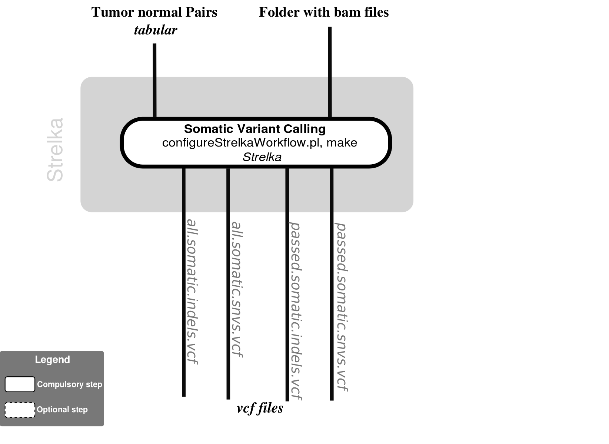

# Strelka-nf
## Variant Calling with Strelka pipeline



## Description
Somatic variant calling workflow for matched tumor-normal samples

## Dependencies

1. This pipeline is based on [nextflow](https://www.nextflow.io). As we have several nextflow pipelines, we have centralized the common information in the [IARC-nf](https://github.com/IARCbioinfo/IARC-nf) repository. Please read it carefully as it contains essential information for the installation, basic usage and configuration of nextflow and our pipelines.
2. Install [Strelka.](https://sites.google.com/site/strelkasomaticvariantcaller/home/strelka-workflow-installation)

You can avoid installing all the external software by only installing Docker. See the [IARC-nf](https://github.com/IARCbioinfo/IARC-nf) repository for more information.


## Input
  | Type           | Description                                                                                         |
  |----------------|-----------------------------------------------------------------------------------------------------|
  | --tn_pair      | Tab delimited text file with two columns called normal and tumor. Each line is a pair of bam files. |
  | --input_folder | Folder containing BAM files.                                                                        |

  Specify the test files location

## Parameters

  * #### Mandatory
| Name      | Example value                                       | Description                               |
|-----------|-----------------------------------------------------|-------------------------------------------|
| --ref     | hg19.fa                                             | reference genome in fasta format          |
| --strelka | ~/strelka/1.0.15/bin/                               | configureStrelkaWorkflow.pl explicit path |                          |
| --config  | ~/strelka/1.0.15/etc/strelka_config_bwa_default.ini | configuration file                        |

  * #### Optional
| Name            | Default value  | Description          |
|-----------------|----------------|----------------------|
| --cpu           | 2              | number of cpu to use |
| --output_folder | strelka_ouptut | output folder name   |

  * #### Flags

Flags are special parameters without value.

| Name      | Description     |
|-----------|-----------------|
| --help    | Display help |


## Usage
  ```
  nextflow run iarcbioinfo/strelka-nf --ref hg38.fa --tn_pairs pairs.txt --input_folder path/to/bam/ --strelka path/to/strelka/ --config strelka/1.0.15/etc/strelka_config_bwa_default.ini
  ```

## Output
  | Type                      | Description                |
  |---------------------------|----------------------------|
  | all.somatic.indels.vcf    | somatics indels            |
  | all.somatic.snvs.vcf      | somatics variants          |
  | passed.somatic.indels.vcf | filtered somatics indels   |
  | passed.somatic.snvs.vcf   | filtered somatics variants |


## Detailed description
Strelka is an analysis package designed to detect somatic SNVs and small indels from the aligned sequencing reads of matched tumor-normal samples.
1. configureStrelkaWorkflow.pl generate a MAKEFILE
2. make run the analysis

## Directed Acyclic Graph


## Contributions

  | Name              | Email                  | Description                                                         |
  |-------------------|------------------------|---------------------------------------------------------------------|
  | Cahais Vincent    | vincent.cahais@iarc.fr | Developer to contact for support (link to specific gitter chatroom) |


## References

[Strelka: Accurate somatic small-variant calling from sequenced tumor-normal sample pairs. Christopher T. Saunders; Wendy Wong; Sajani Swamy; Jennifer Becq; Lisa J. Murray; R. Keira Cheethamn Bioinformatics 2012; doi: 10.1093/bioinformatics/bts271](https://academic.oup.com/bioinformatics/article/28/14/1811/218573/Strelka-accurate-somatic-small-variant-calling)
